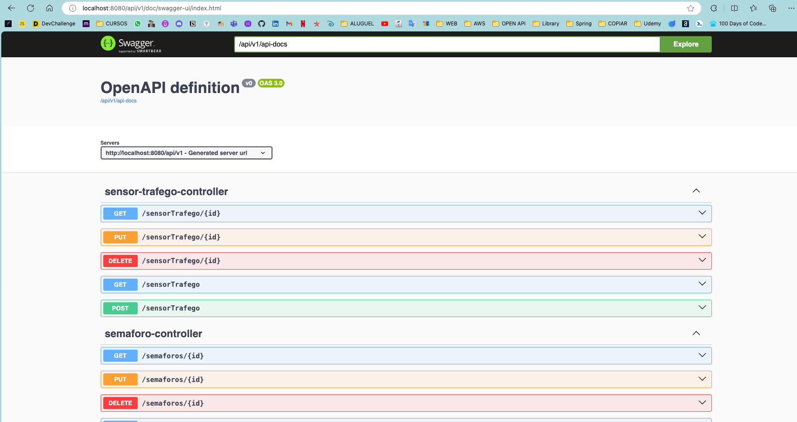

# Gerenciador de trafego FIAP

## Índice

1. [Funcionalidades](#funcionalidades)
2. [Tecnologias Utilizadas](#tecnologias-utilizadas)
3. [Pré-requisitos](#pré-requisitos)
4. [Estrutura de Diretórios](#estrutura-de-diretórios)
5. [Instalação](#instalação)
6. [Configuração do Banco de Dados](#configuração-do-banco-de-dados)
7. [Executando o Projeto](#executando-o-projeto)
8. [Acessar Documentação da API](#acessar-documentação-da-api)
9. [Uso da Aplicação com Insomnia](#uso-da-aplicação-com-insomnia)
10. [Contribuição](#contribuição)
11. [Licença](#licença)

## Funcionalidades

- Registro e consulta de acidentes
- Registro e consulta de rotas
- Registro e consulta de semáforos
- Registro e consulta de condições climáticas

## Tecnologias Utilizadas

- Java 21
- Spring Boot
- Maven
- Docker
- PostgreSQL/Oracle

## Pré-requisitos

- Java 21
- Maven
- Insomnia ou outro cliente para requisições HTTP
- Banco de dados PostgreSQL ou Oracle
- Docker e Docker Compose (opcional caso não a instalado um banco de dados)

## Estrutura de Diretórios

O projeto possui a seguinte estrutura de diretórios:
<details>
<summary> Clique para ver a estrutura de diretórios </summary>

```
├── Dockerfile (DockerFile para construir a imagem da aplicação)
├── Gerenciador Trafego - FIAP.json (Collection para o Insomnia)
├── HELP.md
├── README.md
├── docker-compose.yml (Contem os serviços de banco de dados e app)
├── mvnw
├── mvnw.cmd
├── pom.xml
├── src
    ├── main
       ├── java
       │   └── com
       │       └── fiap
       │           ├── MainApplication.java
       │           ├── acidente
       │           │   ├── controller
       │           │   │   └── AcidenteController.java
       │           │   ├── dto
       │           │   │   ├── AcidenteCreateDTO.java
       │           │   │   ├── AcidenteUpdateDTO.java
       │           │   │   └── AcidenteViewDTO.java
       │           │   ├── exception
       │           │   │   └── AcidenteNaoEncontradoException.java
       │           │   ├── model
       │           │   │   ├── Acidente.java
       │           │   │   └── Gravidade.java
       │           │   ├── repository
       │           │   │   └── AcidenteRepository.java
       │           │   └── service
       │           │       └── AcidenteService.java
       │           ├── clima
       │           ├── exceptions
       │           │   ├── AppGerenciadorTrafegoException.java
       │           │   └── ExceptionHandlerController.java
       │           ├── rota
       │           ├── semaforo
       │           └── sensorTrafego
       └── resources
           ├── HttpRequest.http
           ├── application-oracle.yml
           ├── application-postgres.yml
           ├── application.properties
           ├── db
              └── migration
                  ├── oracle
                  │   ├── V1__create_table-clima.sql
                  │   └── V2__create_table-gti_semaforo.sql
                  │   ├── V3__create_table-reg-acidente.sql
                  │   └── V4__create_table_t_gti_rota.sql
                  │   └── V5__create_table_t_gti_sensor_trafego.sql
                  │   └── V6__create_table-usuarios.sql
                  └── postgres
                      ├── V1__create_table-clima.sql
                      ├── V2__create_table-gti_semaforo.sql
                      ├── V3__create_table-reg-acidente.sql
                      ├── V4__create_table_t_gti_rota.sql
                      └── V5__create_table_t_gti_sensor_trafego.sql
                      └── V6__create_table-usuarios.sql

```

</details>

## Instalação

### Clonando o Repositório

1. Clone o repositório:
    ```sh
    git clone https://github.com/Abimael-Lovera/gerenciador-trafego-fiap.git
    ```
2. Navegue até o diretório do projeto:
3. Abra o projeto na IDE de sua preferência(IntelliJ, Eclipse, VSCode).

### Configuração do Banco de Dados

1. O projeto está configurado para utilizar um banco de dados PostgreSQL por padrão, mas pode ser alterado para Oracle.
   Para isso, é importante alterar o arquivo `application.properties` onde estão configurados os profiles para
   PostgreSQL e Oracle.

   Para PostgreSQL:
   ```properties
   spring.profiles.active=postgres
   ```

   Para Oracle:
   ```properties
   spring.profiles.active=oracle
   ```

2. Lembre-se de alterar o url, username e password do banco de dados no arquivo `application-<postgres.yml` ou
   `application-<oracle.yml`.

   Exemplo do arquivo `application-postgres.yml`:

   ```yml
    spring:
      config:
        activate:
          on-profile: postgres
      datasource:
        url: jdbc:postgresql://localhost:5432/database # url do banco de dados
        username: fiap # nome de usuário do banco de dados
        password: senhaFiap # senha do usuário do banco de dados
        driver-class-name: org.postgresql.Driver
    ```
3. (Opcional) Existe no projeto um arquivo docker-compose.yml configurado com o banco de dados PostgreSQL. Para
   utilizá-lo, basta executar o comando abaixo:
    ```sh
    docker-compose -f docker-compose.yml up postgres-db
    ```

## Executando o Projeto

Para executar o projeto, basta seguir um dos passos abaixo:

1. Ir até a classe `MainApplication` e rodar no IntelliJ ou Eclipse.

2. (Opcional)Para executar o projeto com Docker Compose, basta executar o comando abaixo:
    ```sh
    docker-compose -f docker-compose.yml up app
    ```

### O projeto subirá no http://localhost:8080/api/v1

## Acessar documentação da API

A documentação da API está disponível em http://localhost:8080/api/v1/doc/swagger-ui/index.html


## Uso da aplicação com Insomnia

Dentro do projeto, há um arquivo **Gerenciador Trafego - FIAP.json** que contém a coleção de requisições HTTP que podem ser
utilizadas.

> [!IMPORTANT]
> 1. Existe dois tipos de usuários: ADMIN e USER.
> 2. O usuário ADMIN tem acesso a todos os endpoints, enquanto o usuário USER tem apenas acesso aos endpoints de tipo "
     GET".
> 3. Para realizar a requisição, é necessário ter o token JWT válido(Gerar o token no endpoint de "
     /api/v1/auth/register").
> 4. Os endpoints de documentação swagger e OpenAPI não precisam de autenticação com o token JWT.

## 1. Autenticação

<details>
<summary> Clique para ver exemplos dos endpoints </summary>

### Autenticação com usuário

```http
POST http://localhost:8080/api/v1/auth/register
Content-Type: application/json

{
	"nome": "Usuario FIAP",
	"email": "user@fiap.com.br",
	"senha": "123456",
	"role": "USER"
}
```

### Autenticação com usuário e token JWT

```http
POST http://localhost:8080/api/v1/auth/login
Content-Type: application/json

{
	"email": "user@fiap.com.br",
	"senha": "123456"
}
```

### Autenticação com usuário inválido

```http
POST http://localhost:8080/api/v1/auth/login
Content-Type: application/json

{
    "email": "usuário@fiap.com.br",
---

## 2. Clima

<details>
<summary> Clique para ver exemplos dos endpoints </summary>

### Criar Clima

```http
POST http://localhost:8080/api/v1/clima
Content-Type: application/json

{
    "dsCondicao": "Ensolarado",
    "nrTemperatura": 29.0,
    "nrUmidade": 65.0,
    "dtRegistro": "2024-10-30"
}
```

### Buscar todos os Climas

```http
GET http://localhost:8080/api/v1/clima
```

### Buscar Clima por Id

```http
GET http://localhost:8080/api/v1/clima/1
```

### Atualizar Clima

```http
PUT http://localhost:8080/api/v1/clima/1
Content-Type: application/json

{
    "dsCondicao": "Chuvoso",
    "nrTemperatura": 22.0,
    "nrUmidade": 85.0,
    "dtRegistro": "2024-10-25"
}
```

</details>

---

## 3. Semaforos

<details>
<summary> Clique para ver exemplos dos endpoints </summary>

### Buscar Todos

```http
GET http://localhost:8080/api/v1/semaforos
```

### Buscar por Id

```http
GET http://localhost:8080/api/v1/semaforos/1
```

### Criar

```http
POST http://localhost:8080/api/v1/semaforos
Content-Type: application/json

{
    "dsLocalizacao": "Avenida Paulista, SP",
    "dsEstado": "verde",
    "nrDuracaoEstado": 10,
    "dtUltAtualizacao": "2024-10-31",
    "climaId": 3
}
```

### Atualizar

```http
PUT http://localhost:8080/api/v1/semaforos/1
Content-Type: application/json

{
    "dsLocalizacao": "Avenida Paulista, SP - Atualizando",
    "dsEstado": "amarelo",
    "nrDuracaoEstado": 10,
    "dtUltAtualizacao": "2024-11-10",
    "climaId": 3
}
```

### Excluir

```http
DELETE http://localhost:8080/api/v1/semaforos/1
```

</details>

---

## 4. Acidentes

<details>
<summary> Clique para ver exemplos dos endpoints </summary>

### Buscar Todos

```http
GET http://localhost:8080/api/v1/acidentes
```

### Buscar por Id

```http
GET http://localhost:8080/api/v1/acidentes/1
```

### Buscar por data de gravidade

```http
GET http://localhost:8080/api/v1/acidentes/relatorio/por-data-e-gravidade?data=2024-10-31&gravidade=leve
```

### Buscar sumarizado de quantidade de acidentes por gravidade filtrando pela data

```http
GET http://localhost:8080/api/v1/acidentes/relatorio/por-data?data=2024-10-31
```

### Criar

```http
POST http://localhost:8080/api/v1/acidentes
Content-Type: application/json

{
    "localAcidente": "Avenida Paulista, São Paulo",
    "dataAcidente": "2024-10-31",
    "gravidade": "LEVE",
    "nrFluxoImpactado": 200,
    "semaforoId": 1
}
```

### Atualizar

```http
PUT http://localhost:8080/api/v1/acidentes/1
Content-Type: application/json

{
    "localAcidente": "Avenida Paulista, São Paulo - Teste",
    "dataAcidente": "2024-10-31",
    "gravidade": "MODERADO",
    "nrFluxoImpactado": 200,
    "semaforoId": 1
}
```

### Excluir

```http
DELETE http://localhost:8080/api/v1/acidentes/1
```

</details>

---

## 5. Rotas

<details>
<summary> Clique para ver exemplos dos endpoints </summary>

### Buscar Todos

```http
GET http://localhost:8080/api/v1/rotas
```

### Buscar por Id

```http
GET http://localhost:8080/api/v1/rotas/8
```

### Criar

```http
POST http://localhost:8080/api/v1/rotas
Content-Type: application/json

{
    "descricaoRota": "Avenida Paulista - Teste remover",
    "status": "FECHADA",
    "acidenteId": 3
}
```

### Atualizar

```http
PUT http://localhost:8080/api/v1/rotas/8
Content-Type: application/json

{
    "descricaoRota": "Avenida Paulista - Teste remover",
    "status": "FECHADA",
    "acidenteId": 2
}
```

### Excluir

```http
DELETE http://localhost:8080/api/v1/rotas/7
```

</details>

---

## 6. SensorTrafego

<details>
<summary> Clique para ver exemplos dos endpoints </summary>

### Buscar Todos

```http
GET http://localhost:8080/api/v1/sensorTrafego
```

### Buscar por Id

```http
GET http://localhost:8080/api/v1/sensorTrafego/9
```

### Criar

```http
POST http://localhost:8080/api/v1/sensorTrafego
Content-Type: application/json

{
    "qtFluxoVeiculos": 24,
    "nrVisibilidade": 50,
    "dtDeteccao": "2024-11-12",
    "semaforoId": 1
}
```

### Atualizar

```http
PUT http://localhost:8080/api/v1/sensorTrafego/9
Content-Type: application/json

{
    "qtFluxoVeiculos": 30,
    "nrVisibilidade": 15,
    "dtDeteccao": "2024-10-31",
    "semaforoId": 1 
}
```

### Excluir

```http
DELETE http://localhost:8080/api/v1/sensorTrafego/10
```

</details>

---

## 7. Usuários

<details>
<summary> Clique para ver exemplos dos endpoints </summary>

### Buscar Todos

```http
GET http://localhost:8080/api/v1/usuarios
```

### Buscar por Id

```http
GET http://localhost:8080/api/v1/usuarios/1
```

### Atualizar

```http
PUT http://localhost:8080/api/v1/usuarios/1
Content-Type: application/json

{
    "login": "usuário@fiap.com.br",
    "senha": "12345678"
}
```

### Excluir

```http
DELETE http://localhost:8080/api/v1/usuarios/1
```

</details>

---

## Contribuição

Contribuições são bem-vindas! Sinta-se à vontade para abrir uma issue ou enviar um pull request.

1. Faça um fork do projeto.
2. Crie uma nova branch (`git checkout -b feature/nova-funcionalidade`).
3. Faça suas alterações e commit (`git commit -m 'Adiciona nova funcionalidade'`).
4. Envie para o repositório remoto (`git push origin feature/nova-funcionalidade`).
5. Abra um pull request.

## Licença

Este projeto está licenciado sob a Licença MIT. Veja o arquivo [LICENSE](LICENSE) para mais detalhes.